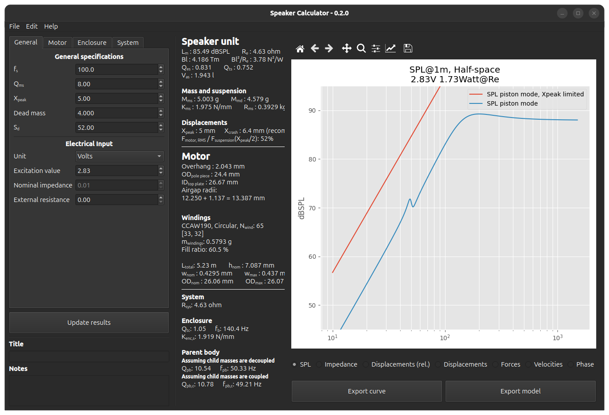

# Speaker Calculator
**Calculation tool for loudspeaker design**
Written for Python 3.12.x

## Features
* Modelling of loudspeaker response in free-air and closed box.
  * SPL, electrical impedance, displacements, net forces
* Automatic calculation of most appropriate coil winding for given user parameters.
  * Wire properties are read from user editable "wire table.ods".
  * Possible to calculate for different types of wire section (round, flat, etc.)
* Includes a second degree of freedom to observe the effects on parent structure.
* Possible to manipulate graph settings and export curves.
* Calculation of magnet system mechanical clearances.
* Possible to save/load state.

## Out of scope
* Nonlinearities in the system
* Calculation of magnetic flux
* Calculation of mass of speaker components (with the exception of the windings)
* Electrical inductance
* Change of acoustical impedance at higher frequencies

## Screenshots

## Manual
### Underlying model
The application uses a linear model with 3 degrees of freedom to do the calculations. To see how the model is built, see function `_build_symbolic_ss_model` in `electracoustical.py`.
