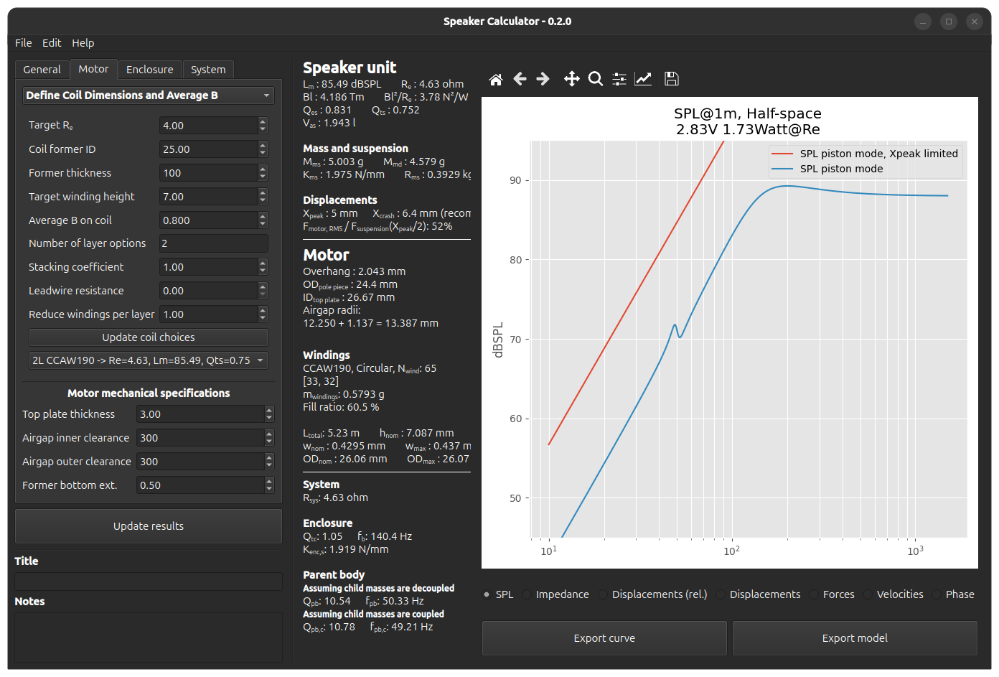
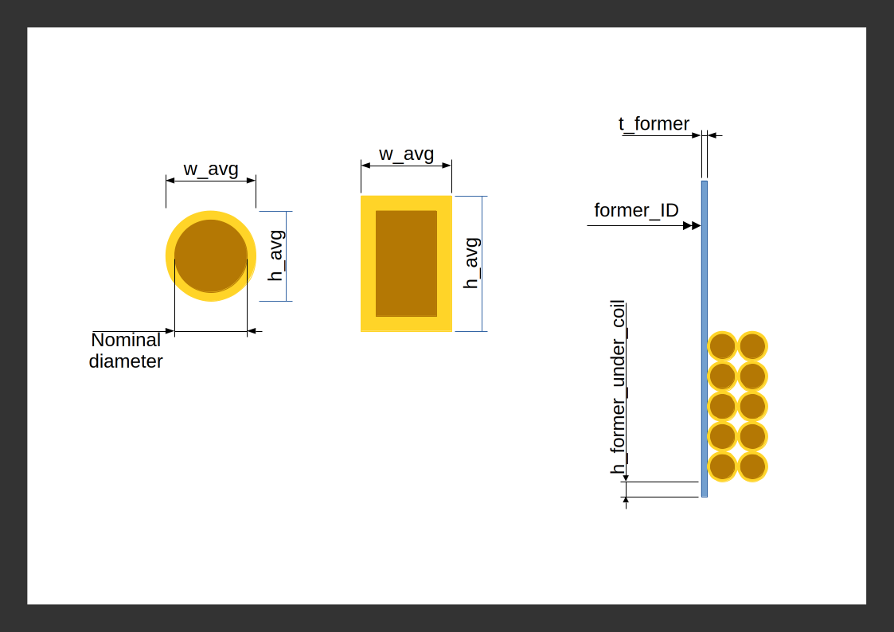
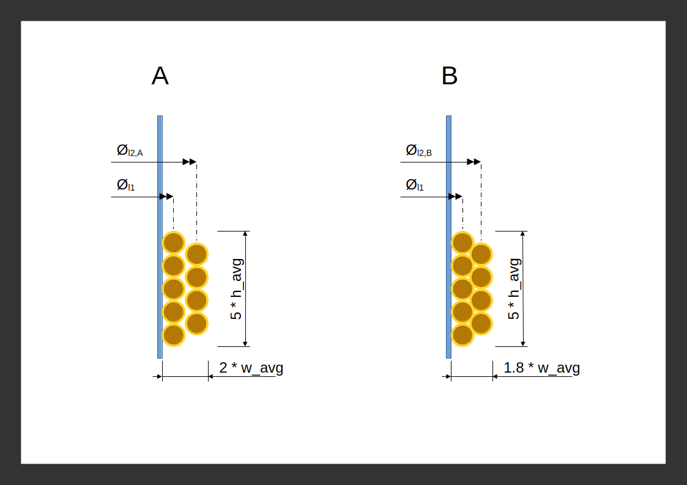
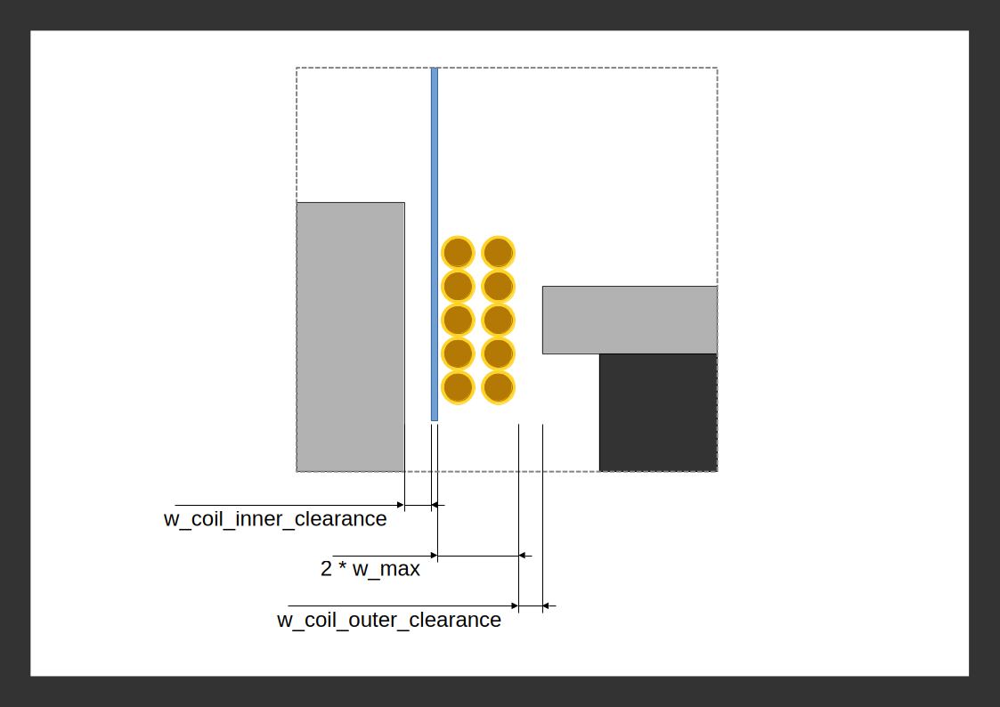

# Speaker Calculator
**Calculation tool for loudspeaker design**
Written for Python 3.12.x

## Features
* Modelling of loudspeaker response in free-air and closed box.
  * SPL, electrical impedance, displacements, net forces
* Automatic calculation of most appropriate coil winding for given user parameters.
  * Wire properties are read from user editable "wire table.ods".
  * Possible to calculate for different types of wire section (round, flat, etc.)
* Includes a second degree of freedom to observe the effects on parent structure.
* Possible to manipulate graph settings and export curves.
* Calculation of magnet system mechanical clearances.
* Save/load of state.

## Out of scope
* Nonlinearities in the system
* Calculation of magnetic flux
* Calculation of mass of speaker components (with the exception of the windings)
* Electrical inductance
* Change of acoustical impedance at higher frequencies

## Screenshots

## Manual
### Underlying model
The application uses a linear model with 3 degrees of freedom to do the calculations. To see how the model is built, see function `_build_symbolic_ss_model` in `electracoustical.py`.

> [!IMPORTANT]
> The third degree of freedom which represents the vented port or passive radiator is not included in this version.

> [!TIP]
> Most parameters in the application include a tooltip. Hover your mouse on the parameter for a few seconds whenever you have doubts on what a parameter does.

### Coil windings
The application will give you coil winding options based on the winding height and the coil resistance you input as requirement. To be able to do this, a separate table that has information on different wire types needs to be provided by the user. This table is stored in `wire table.ods` which is located in subfolder `data` in the installation folder.

> [!TIP]
> To see the location of `wire table.ods` in your computer go to *Help -> Show paths of assets..* from within the application.

### Wire table
This workbook contains *Sheet1* which contains the following columns for each wire type.
- **Unique name** : Common name used to refer to this wire. Must be unique in this column.
- **Type** : Category for the wire
- **Nominal size** : Expected size of the conductor.
- **Shape** : Circular, square, rectangular etc.
- **Average width; w_avg** : This is the expected physical width including all the coatings and glues on the wire.
- **Average height; h_avg** : Similar to average width, but for height.
- **Maximum width; w_max** : This is the maximum expected physical width including all the coatings and glues on the wire.
- **Resistance** : Resistance per meter.
- **Mass density** : Mass per meter.
- **Notes** : User notes for convenience. Not used by the application.

User needs to input the correct information for the wires in this table. The top three rows of the spreadsheet contain title rows for import and they should not be modified.

### Basic wire dimensions

### Winding dimensions
For each layer, the **average** thickness of the wire *w_avg* is used to calculate a winding diameter passing through the center of the wire. This is shown with *Øli* in image below.

**In example A**, stacking coefficient is chosen as 1.0, which means the wires do not mesh into the previous layer of winding. Total thickness of winding is simply `2 * w_avg`.

**Example B** has a stacking coefficient of 0.8. This causes all the layers consecutive to the first layer to have a thickness of `0.8 * w_avg`, instead of `w_avg`. Total thickness of winding becomes `1.8 * w_avg` in this example. If there were three layers it would have become `2.6 * w_avg`.

> [!NOTE]
> For electricity related calculations such as winding length, the average dimensions defined in wire table (i.e. `w_avg`, `h_avg`) are considered.

### Mechanical clearances

> [!NOTE]
> For mechanical clearances and airgap sizes, the maximum dimensions defined in wire table (i.e. `w_max`) are considered.
